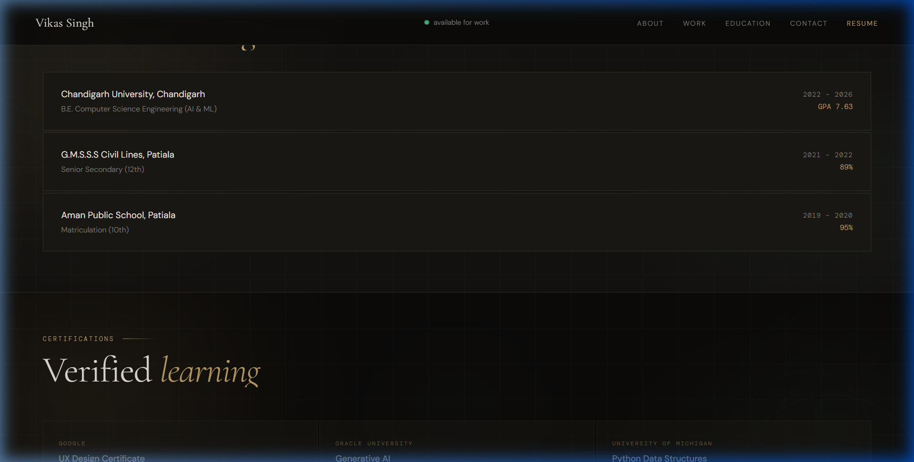
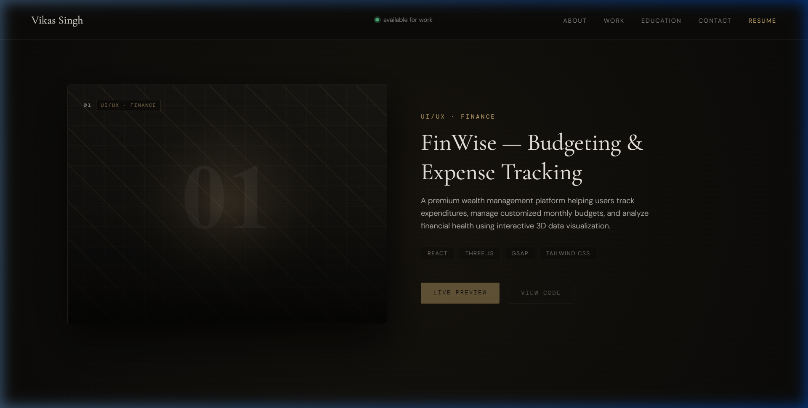
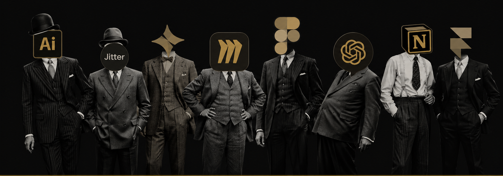
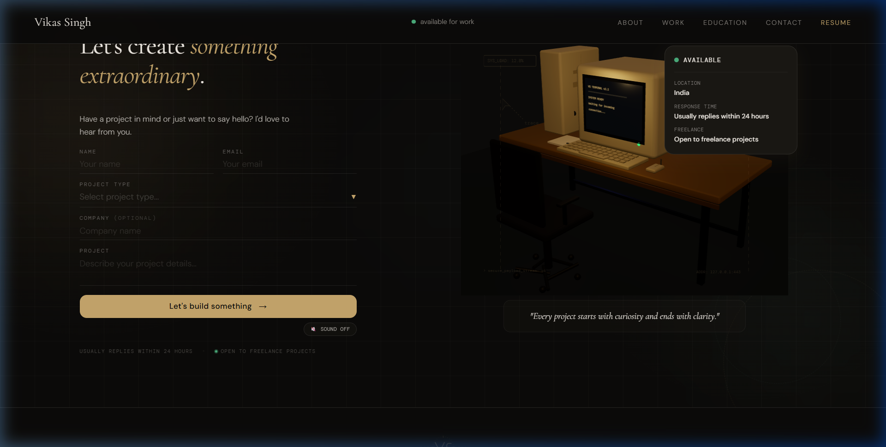
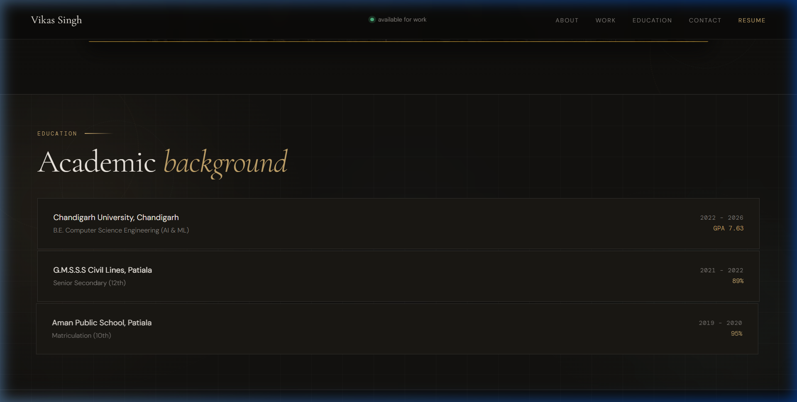
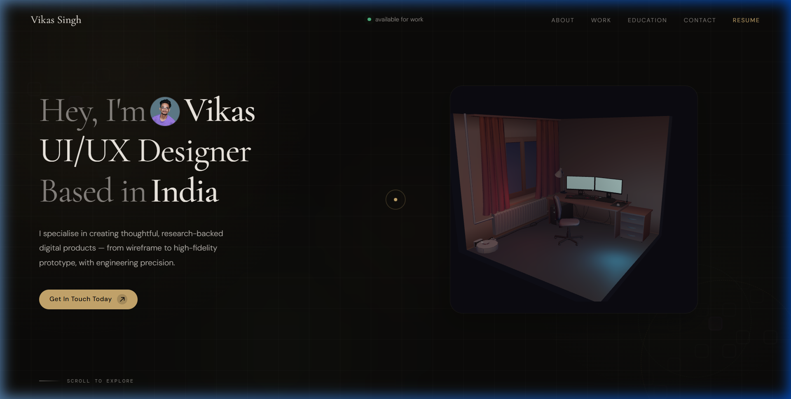

<div align="center">

# Vikas Singh — UI/UX & Product Designer Portfolio

### *Crafting thoughtful, research-backed digital products from wireframe to high-fidelity 3D prototype with engineering precision.*

A modern, highly performant web portfolio featuring interactive 3D WebGL scenes, cinematic preloader sequences, GSAP scroll-triggered animations, and a retro CRT workstation terminal.

[](https://react.dev/)
[](https://vitejs.dev/)
[](https://threejs.org/)
[](https://gsap.com/)
[](https://r3f.docs.pmnd.rs/)
[](https://tailwindcss.com/)
[](./LICENSE)

</div>

---

## 🚀 Live Demo

Explore the live portfolio and interactive 3D web experience:

<div align="center">

[](https://your-portfolio-domain.com)
[](https://your-resume-url.com)
[](https://github.com/vikas0223/Portfolio)

</div>

---

## 🎨 Portfolio Preview

Here is a visual overview of key sections across the experience:

| Section | Preview |
| :--- | :--- |
| **Hero Section** |  |
| **About Section** |  |
| **Projects Showcase** |  |
| **Usual Suspects** |  |
| **Contact Terminal** |  |
| **Mobile View** |  |
| **Preloader Experience** |  |

---

## 📖 About Project

This portfolio was designed and built to bridge the gap between technical software engineering and modern UI/UX design thinking. Rather than relying on static templates or standard component libraries, this platform treats the portfolio itself as a digital product—focusing on visual hierarchy, interactive physical metaphors, and spatial storytelling.

### Design Thinking & Interaction Philosophy
The project embraces a **dark-navy and warm gold** aesthetic (`#0c0b11` dark base with `#c9a96e` metallic accents). Inspired by developer environments and luxury interface design, the application introduces physical interaction elements:
- **Spatial 3D Environments**: Ambient lighting, screen reflections, and responsive room tilt based on cursor coordinates.
- **Micro-Animations & Audio Feedback**: Tactile click feedback via Web Audio API oscillators, smooth Lenis inertia scrolling, and GSAP scroll triggers.
- **Narrative Structure**: Visitors transition naturally from high-level positioning (Hero) into technical philosophy (About), shipping record (Projects), tools & design system (Usual Suspects), and an interactive CRT workstation (Contact).

---

## ✨ Features

- 🎬 **Cinematic Asset Preloader**: Multi-stage progress loader with percentage tracking and coordinated screen reveal timeline.
- 🖥️ **Interactive 3D Hero Scene**: Custom dark isometric developer room rendered with React Three Fiber, featuring interactive lighting and tilt effects.
- 🎯 **Custom Cursor**: Dual-element magnetic cursor with subtle smooth interpolation and hover interactions across interactive nodes.
- 📜 **GSAP Scroll Animations**: Scrub-synchronized split-text reveals, element fades, and pinned section transitions.
- 📱 **Responsive Layout**: Dedicated layouts optimized for mobile devices and high-DPI desktop screens.
- 🎭 **3D Split-Text Curtain Reveal**: Pinned vertical scrolling timeline for featured project showcases.
- 🕹️ **Interactive CRT Contact Terminal**: Retro computer monitor with state-machine boot sequence, live typing state feedback, and canvas texture updates.
- 🔊 **Web Audio API Integration**: Synthesizer audio click feedback when toggled by the user.
- 📄 **Live Resume Viewer & Download**: Integrated modal window for PDF preview and download.
- ⚡ **Optimized 60FPS Performance**: Low-draw-call geometry, compressed GLTF models, and passive event listeners.

---

## 🛠️ Tech Stack

| Category | Technology | Usage / Purpose |
| :--- | :--- | :--- |
| **Frontend** | React 19, Vite 8 | UI components, fast HMR build toolchain |
| **Animation** | GSAP 3.15, Lenis Scroll | ScrollTrigger timeline orchestrations, smooth inertial scroll |
| **3D & Graphics** | Three.js, React Three Fiber, Drei | WebGL canvas rendering, camera controls, GLTF loading |
| **Design & Styling** | Tailwind CSS 4, Vanilla CSS | Utility styling, custom design system tokens, typography |
| **Utilities** | Lucide React, Web Audio API | Vector icons, synthetic audio clicks, custom hook preloader |
| **Deployment** | Vercel / Netlify | Continuous integration, global CDN hosting |

---

## 📁 Project Structure

```
Portfolio/
├── public/
│   ├── screenshots/             # Portfolio preview screenshots
│   ├── computer-optimized.glb   # 3D CRT monitor model asset
│   ├── favicon.svg              # Favicon asset
│   └── icons.svg                # Vector icon sprites
├── src/
│   ├── assets/
│   │   ├── icons/               # SVG design tools & icons
│   │   ├── images/              # Profile & background visual assets
│   │   ├── models/              # Optimized GLTF room 3D models
│   │   └── textures/            # Canvas & material texture overlays
│   ├── components/
│   │   ├── layout/              # Navbar & Footer navigation wrappers
│   │   ├── preloader/           # Preloader screen & HeroReveal timeline
│   │   ├── sections/            # Hero, About, Projects, UsualSuspects, Contact
│   │   └── ui/                  # Custom Cursor, SectionGlow, DesignerDoodles
│   ├── config/
│   │   ├── education.js         # Academic timeline & skill configuration
│   │   ├── projectData.js       # Featured projects metadata & URLs
│   │   ├── siteConfig.js        # Global site branding & biography
│   │   └── socialLinks.js       # Social network profiles
│   ├── hooks/
│   │   └── useAssetPreloader.js # Asset & texture preloading hook
│   ├── resume/
│   │   └── Resume 2.pdf         # Resume document
│   ├── styles/                  # Custom layout styles & CSS overrides
│   ├── three/
│   │   ├── ContactScene.jsx     # R3F CRT Terminal monitor scene & canvas logic
│   │   └── HeroScene.jsx        # R3F Isometric developer room scene
│   ├── App.jsx                  # Main application orchestrator
│   ├── main.jsx                 # React root entrypoint
│   └── index.css                # Global CSS tokens & Tailwind imports
├── .gitignore                   # Git ignore file
├── eslint.config.js             # ESLint configuration
├── index.html                   # HTML template
├── package.json                 # Project dependencies & scripts
├── README.md                    # Repository documentation
└── vite.config.js               # Vite build configuration
```

---

## 🖼️ Screenshots

Place portfolio screenshot assets inside `public/screenshots/` to display them across documentation:

- `public/screenshots/hero.png` — Hero section with 3D Room model
- `public/screenshots/about.png` — About section biography & design doodles
- `public/screenshots/projects.png` — Projects split-text curtain reveal
- `public/screenshots/usual-suspects.png` — Design tools & software stack grid
- `public/screenshots/contact.png` — Interactive CRT terminal contact section
- `public/screenshots/mobile.png` — Mobile viewport layout stack
- `public/screenshots/preloader.png` — Intro asset preloader screen

---

## 💻 Featured Projects

### 01. FinWise — Budgeting & Expense Tracking
- **Short Description**: A premium wealth management platform helping users track expenditures, manage customized monthly budgets, and analyze financial health using interactive 3D data visualization.
- **Key Features**: Expense categorisation, interactive budget charts, custom financial goals, responsive dashboard.
- **Technologies**: React, Three.js, GSAP, Tailwind CSS
- **Links**: [](https://github.com/vikas0223/FinWise) [](https://finwise-demo.com)

### 02. NEONVOID — Record Store Platform
- **Short Description**: An immersive digital vinyl record marketplace featuring an interactive 3D turntable player, ambient audio visualization, and a dark cyberpunk aesthetic.
- **Key Features**: 3D turntable vinyl player, Web Audio API waveform visualizer, dynamic shopping cart, dark theme.
- **Technologies**: React, Three.js, Web Audio API, Tailwind CSS
- **Links**: [](https://github.com/vikas0223/NeonVoid) [](https://neonvoid-demo.com)

### 03. Workout Planning App
- **Short Description**: A highly customizable fitness planner application that allows users to create structured routines, log historical training sets, and track progressive overload goals.
- **Key Features**: Custom routine builder, set/reps logging, progressive overload tracking, calendar history.
- **Technologies**: React Native, Expo, Reanimated, Redux
- **Links**: [](https://github.com/vikas0223/WorkoutApp) [](https://workoutapp-demo.com)

### 04. Saanjh — Mental Wellness Chatbot
- **Short Description**: A responsive mental health companion bot offering users conversational support, cognitive behavioral therapy exercises, and emotional mood tracking logs.
- **Key Features**: AI-guided CBT conversations, daily mood logger, guided breathing exercises, private storage.
- **Technologies**: React, Node.js, OpenAI API, Tailwind CSS
- **Links**: [](https://github.com/vikas0223/Saanjh) [](https://saanjh-demo.com)

---

## 📥 Installation

Follow these steps to set up and run the project locally on your machine:

1. **Clone the repository**:
   ```bash
   git clone https://github.com/vikas0223/Portfolio.git
   cd Portfolio
   ```

2. **Install dependencies**:
   ```bash
   npm install
   ```

3. **Start the local development server**:
   ```bash
   npm run dev
   ```
   Open `http://localhost:5173/` in your web browser.

4. **Build for production**:
   ```bash
   npm run build
   ```

5. **Preview production build**:
   ```bash
   npm run preview
   ```

---

## 💡 Design Philosophy

- 🎯 **Motion with Purpose**: Every animation serves to guide user attention or communicate system feedback, avoiding decorative motion bloat.
- ⬛ **Minimalism & Depth**: Clean spatial layout paired with layered lighting, subtle background glows, and sharp typography.
- 🔤 **Editorial Typography**: Pairing classic serif titles (*Instrument Serif / Playfair*) with clean, high-legibility sans-serif and monospace technical accents.
- 🕹️ **Interaction Design**: Transforming digital forms into tactile physical metaphors (e.g., retro CRT terminal with status indicators).
- ♿ **Accessibility**: High-contrast text nodes, keyboard navigation support, and semantic HTML structure.
- 📖 **Storytelling**: Guiding visitors through a structured journey from introduction to shipping record and contact.
- ⚡ **Performance First**: Efficient draw calls, passive scroll handlers, and preloaded asset pipelines.
- 👤 **Human-Centered Design**: Thoughtful micro-interactions, responsive feedback states, and clear availability indicators.

---

## ⚡ Performance

- **Optimized 3D Assets**: Draco-compressed GLTF models (`optimized-room.glb` & `computer-optimized.glb`).
- **Asset Preloader**: Pre-decodes images and textures before unmasking the viewport.
- **Fluid Layout**: Responsive breakpoints using Tailwind CSS (`sm`, `md`, `lg`, `xl`).
- **Smooth 60FPS Animations**: Hardware-accelerated GSAP transforms (`translate3d` and `scale3d`).
- **Canvas Texture Uploads**: Batch-scheduled canvas texture updates to minimize GPU bandwidth overhead.
- **Modern Build Toolchain**: Vite 8 with Rollup dynamic chunking and tree-shaking optimization.

---

## 🌐 Connect

Let's connect and build something extraordinary:

- **Portfolio**: [Live Website Placeholder](https://your-portfolio-domain.com)
- **LinkedIn**: [linkedin.com/in/vikassingh](https://linkedin.com/in/your-profile)
- **GitHub**: [github.com/vikas0223](https://github.com/vikas0223)
- **Email**: [contact@example.com](mailto:contact@example.com)

---

## 📄 License

Distributed under the MIT License. See [`LICENSE`](./LICENSE) for details.

---

<div align="center">

### Designed & Developed with passion by **Vikas Singh**

*© 2026 Vikas Singh. All rights reserved.*

</div>
